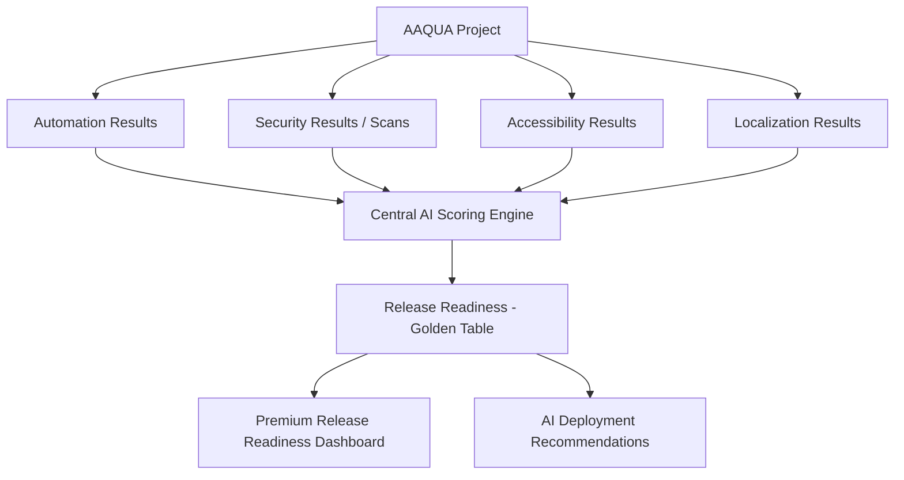

# Unified Project Intelligence Layer — Implementation Plan

This plan transitions AAQUA from a "collection of separate testing utilities" into a **"Project-Centric AI Quality Platform"**. By introducing a centralized **Project** entity as the root of all executions, we unify Automation, Security, Accessibility, and Localization results under a single AI-driven **Release Readiness Layer** (the "Golden Table").

---

## User Review Required

> [!IMPORTANT]
> **Active Project Context**: We propose introducing a centralized **Project Selector Dropdown** in the header of the AAQUA web app. Once a project is selected:
> - Test runs under **Automation** will save to that project.
> - **Security** scans will be initiated and recorded for that project.
> - **Accessibility** & **Localization** runs will log WCAG and translation accuracy scores to that project.
> - The **Release Readiness Dashboard** will serve as the flagship landing page displaying aggregate intelligence for the selected project.
> 
> *Please confirm if this header-based global context matches your vision!*

---

## Proposed Changes

### Component 1: Database Models & Relational Architecture

We will promote the existing `Project` model and create new tables in `server/models/` to reference `project_id`. All models will use UUIDs for robust modern styling and standard Sequelize associations.

#### [MODIFY] [Project.js](file:///d:/AITesting/qa-test-gen/server/models/Project.js)
Update the Project schema to support repository linkings:
- Add `git_url` (STRING, 2048, null allowed) to reference a remote Git repository for Automation test suite execution.

#### [NEW] [AutomationResult.js](file:///d:/AITesting/qa-test-gen/server/models/AutomationResult.js)
Stores metrics of local/uploaded test executions.
- `id` (UUID, PrimaryKey)
- `project_id` (UUID, Foreign Key)
- `execution_date` (DATE)
- `pass_rate` (FLOAT, 0-100)
- `flaky_index` (FLOAT, 0-100)
- `failed_tests` (INTEGER)
- `total_tests` (INTEGER)
- `duration` (INTEGER - execution time in ms)

#### [NEW] [AccessibilityResult.js](file:///d:/AITesting/qa-test-gen/server/models/AccessibilityResult.js)
Stores WCAG compliance scores and automated/AI violation counts.
- `id` (UUID, PrimaryKey)
- `project_id` (UUID, Foreign Key)
- `execution_date` (DATE)
- `wcag_compliance` (FLOAT, percentage)
- `accessibility_score` (FLOAT, 0-10)
- `critical_violations` (INTEGER)
- `serious_violations` (INTEGER)
- `moderate_violations` (INTEGER)
- `minor_violations` (INTEGER)

#### [NEW] [LocalizationResult.js](file:///d:/AITesting/qa-test-gen/server/models/LocalizationResult.js)
Stores AI-driven translation accuracy and localization health.
- `id` (UUID, PrimaryKey)
- `project_id` (UUID, Foreign Key)
- `execution_date` (DATE)
- `translation_accuracy` (FLOAT, percentage)
- `localization_score` (FLOAT, 0-10)
- `missing_keys` (INTEGER)
- `overflow_issues` (INTEGER)

#### [NEW] [ReleaseReadiness.js](file:///d:/AITesting/qa-test-gen/server/models/ReleaseReadiness.js)
The **Golden Table** consolidating all quality dimensions into single readiness summaries.
- `id` (UUID, PrimaryKey)
- `project_id` (UUID, Foreign Key)
- `release_version` (STRING, e.g. "v1.0.0")
- `automation_health` (FLOAT, 0-10)
- `security_health` (FLOAT, 0-10)
- `accessibility_health` (FLOAT, 0-10)
- `localization_health` (FLOAT, 0-10)
- `overall_quality_score` (FLOAT, 0-10)
- `release_confidence` (FLOAT, percentage)
- `production_risk` (STRING: 'High' | 'Medium' | 'Low')
- `ai_summary` (TEXT - interpreted by Local LLM)
- `deployment_recommendation` (TEXT - e.g., "Safe for production", "Requires security review")
- `execution_date` (DATE)

#### [MODIFY] [models/index.js](file:///d:/AITesting/qa-test-gen/server/models/index.js)
Register new associations (Project hasMany AutomationResult, AccessibilityResult, LocalizationResult, and ReleaseReadiness).

---

### Component 2: Central Scoring & AI Intelligence Services

We will build the orchestration and calculation engine inside the backend.

#### [NEW] [readinessService.js](file:///d:/AITesting/qa-test-gen/server/services/readinessService.js)
- Gathers the latest executions across Automation, Security, Accessibility, and Localization for a project.
- Computes mathematical baseline health scores for each dimension (0-10).
- Combines metrics into an `overall_quality_score` and `release_confidence`.
- Calls our Local LLM to analyze the unified profile and output:
  - An executive natural-language `ai_summary` outlining core risks.
  - A definitive `deployment_recommendation`.
  - A project risk heatmap mapping module vulnerability risk.

#### [NEW] [readinessRoutes.js](file:///d:/AITesting/qa-test-gen/server/routes/readinessRoutes.js)
- `GET /api/projects/:projectId/readiness`: Fetch latest release readiness summaries, trends, and risk distributions.
- `POST /api/projects/:projectId/readiness/calculate`: Force recalculation of release readiness utilizing the LLM scoring engine.

#### [MODIFY] Test Execution & Scanners (server/index.js & scan routes)
Modify scan and runner endpoints to write results to their respective database models upon completion, automatically linking to the active `project_id`.

---

### Component 3: Premium UI Dashboard & Sidebar Integration

We will build a high-end interface to give leadership a cohesive command-center experience.

#### [NEW] [ReleaseReadiness.jsx](file:///d:/AITesting/qa-test-gen/src/pages/ReleaseReadiness.jsx)
A state-of-the-art flagship dashboard:
- **Top Metrics Grid**: 4 luxury glassmorphism cards (Release Confidence %, Automation Health, Security Score, Production Risk Tag).
- **Interactive Gauges & Trend Charts**: Built using modern CSS/SVG charting showing historical release comparisons (e.g. Release 1.0 vs 1.1).
- **AI Executive Summary Card**: Displays the Local LLM's natural-language analysis with a pulsing badge representing the release recommendation ("SAFE FOR PRODUCTION" or "BLOCK RELEASE").
- **Risk Heatmap Section**: Renders a visually striking visual grid mapping features (Payments, Login, Account) to risk levels.

#### [MODIFY] [Header.jsx](file:///d:/AITesting/qa-test-gen/src/components/common/Header.jsx)
Integrate a global **Project Selector Dropdown** allowing users to switch projects anywhere in the app. Switch operations will save the active `project_id` to local storage, refreshing the active context.

#### [MODIFY] [App.jsx](file:///d:/AITesting/qa-test-gen/src/App.jsx) & Sidebar
Add unified routing and structure the sidebar to showcase:
- Active Project Overview
- Flagship: **Release Readiness**
- Executions:
  - Automation (Test Runner)
  - Security (Security Scanner)
  - Accessibility (Accessibility Scanner)
  - Localization (Localization Tester)

---

## Verification Plan

### Automated Tests
- Build database synchronization check using `npm run lint` and verify server execution.
- Validate that Sequelize initializes the new tables (`automation_results`, `accessibility_results`, `localization_results`, `release_readiness`) in SQLite/PostgreSQL smoothly.

### Manual Verification
- We will start the dev server and use our browser tool to verify:
  1. The new global Project Selector in the header operates correctly.
  2. The Release Readiness dashboard loads and retrieves calculated profiles from the database successfully.
  3. The local LLM generates high-quality deployment summaries based on mock or scanned data.
